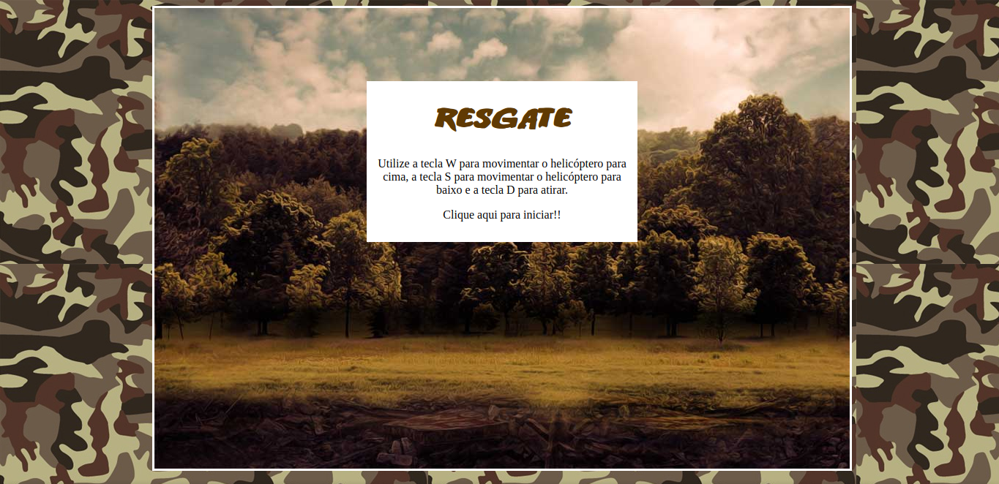
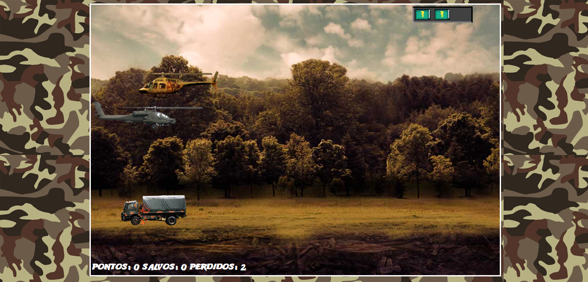

  
<h1>Construindo o seu primeiro jogo de naves
Digital Innovation One</h2>
  

 <a href="#objetivo">Objetivo</a> •
 <a href="#preview">Preview</a> •
 <a href="#tecnologias">Tecnologias utilizadas</a> • 

<h3 id="objetivo">:dart:  Objetivo</h3>

🚀 O projeto desenvolvido é um desafio para o Bootcamp Take Blip Web Developer  da 
<a href="https://www.dio.me/">Digital Innovation One </a>, cujo objetivo é criar um jogo de nave com HTML, CSS e Javascript.

  <h3 id="preview">:camera_flash: Tela 1</h3>
  
   <h3 id="preview">:camera_flash: Tela 2</h3>
  
    

<h3 id="tecnologias">🛠 Tecnologias utilizadas</h3>

- HTML5
- CSS3
- Javascript
- jQuery
- JQuery Collision
